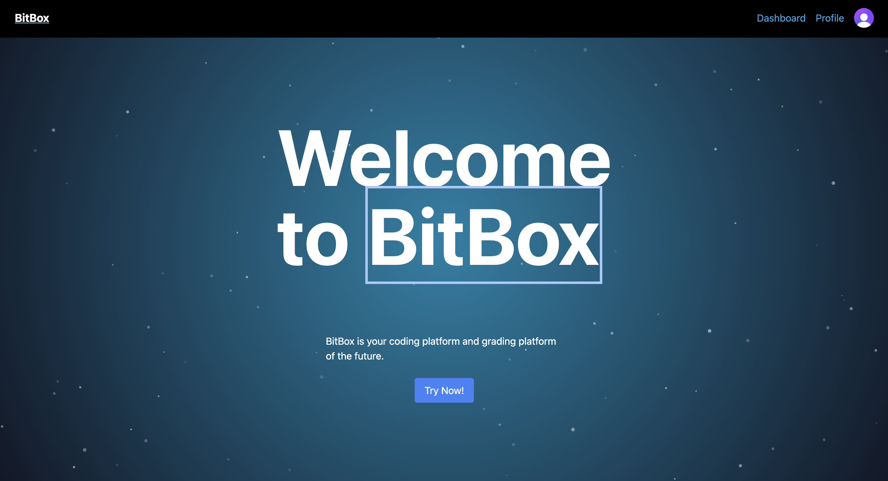

# CodeCrewLabs

CodeCrewlabs is a free and open source e-learning environment with an interactive codepen-like web playground and a multi-language repl built with the judge0 api and monaco editor. You can create projects in multiple programming languages to practice your coding skills and even ask questions about your code or generate labs with our openai integration.

## Running Locally

You will need to have node, docker, and docker-compose installed on your machine before moving forward. You will also need to sign up and obtain api keys from openai and clerck

Quick Start - Run a copy of CodeCrewLabs by forking our repo, cloning it down to your own machine, and running a few simple commands. After cloning, cd into your local repo and take the following steps.

1. In order to use the chat bot and lab generators you need to add an openai api key to your project. Start by adding a `.env.local` file in the root of your project then add the key value pair `OPENAI_API_KEY=your-api-key-here` ensure that the spelling is correct and you have added your own working openai api key. Obtain your key at [Openai's official platform](https://platform.openai.com/). After signing up and signing in your api keys can be viewed by clicking on the profile icon at the top right and selecting View API Keys

2. To set up cleck for authentication sign up at [clerk.com](https://clerk.com/) then add the following to the `.env.local` file you created in step #1.

    ```
    NEXT_PUBLIC_CLERK_PUBLISHABLE_KEY=your-publishable-key
    CLERK_SECRET_KEY=Your-client-cecret-key
    NEXT_PUBLIC_CLERK_SIGN_IN_URL=/sign-in
    NEXT_PUBLIC_CLERK_SIGN_UP_URL=/sign-up
    NEXT_PUBLIC_CLERK_AFTER_SIGN_IN_URL=/dashboard
    NEXT_PUBLIC_CLERK_AFTER_SIGN_UP_URL=/dashboard
    ```

    your publishable key and secret will be available on your clerk account after you sign up and the rest of the key value pairs should should look exactly the same.

3. After you have obtained your api keys and placed them in your `.env.local`, run `npm install` in your projects root directory to install all required node packages

4. run `docker-compose up` which will download and configure the docker containers necessary to run the application in development including the judge0 api and mongodb

5. Once your containers are up and running, and you have the node packages installed,
we recomend running `npm run build` followed by `npm run start` you can then visiting the running app at <http://localhost:3000/>.

6. You can also see a live preview with automatic updates every time you save by running `npm run dev`.Your live preview will be running on <http://localhost:3000/>

## Development Tech Stack

* Nextjs
* React
* TypeScript
* MongoDB
* judge0
* Openai
* Tailwind
* Docker

## Demo

[](https://res.cloudinary.com/dcrnncysg/video/upload/v1698081871/bitbox_demo_m_duapo1.mov)

